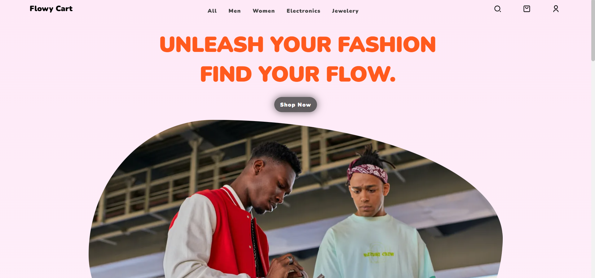
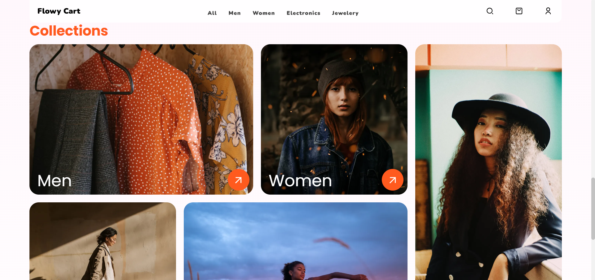
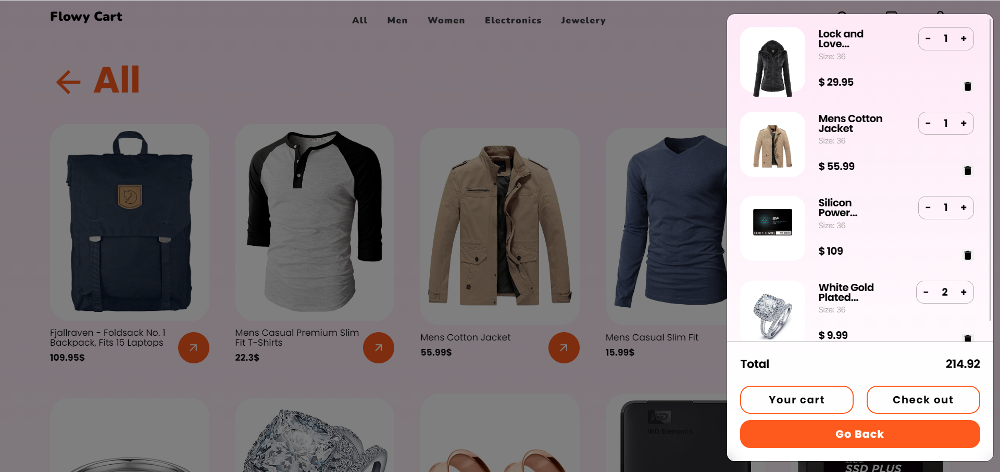
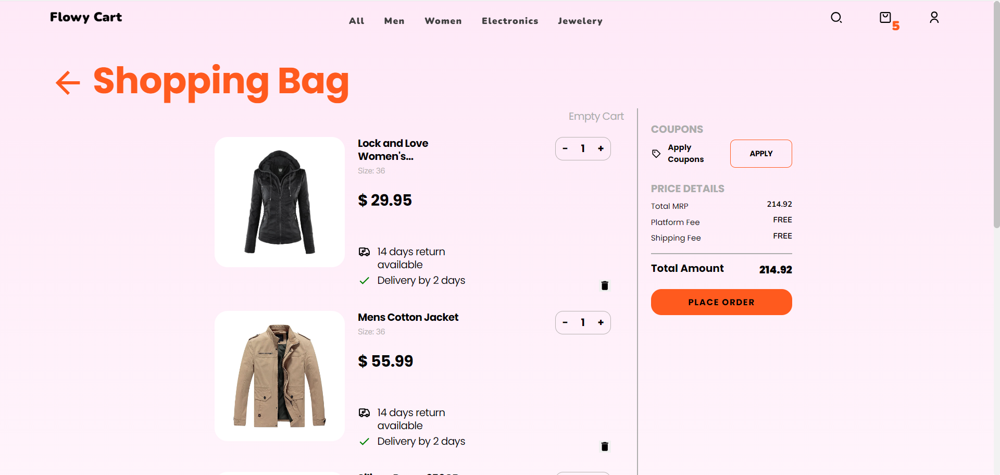

# Flowy Cart - E-commerce Store

🌐 [**Demo**](https://flowy-cart-rahil1202.vercel.app/)

## Overview

Snap Shop is a modern E-commerce site built using React, Redux, Redux Toolkit, React Router DOM, and TypeScript. The application features a responsive design and includes essential e-commerce functionalities.

## Technologies Used

+ **React:** A JavaScript library for building user interfaces.
+ **Redux:** A state management library for React applications.
+ **Redux Toolkit:** The official, opinionated, batteries-included toolset for efficient Redux development.
+ **Redux-thunk:** Middleware for handling asynchronous actions in Redux.
+ **Typescript:** A superset of JavaScript that adds static typing to the language.
+ **Axios:** A promise-based HTTP client for making requests to a backend server.
+ **React Router v6:** Declarative routing for React.js.
+ **Framer Motion:** A popular animation library for React.
+ **SwiperJS:** A modern touch slider library.

## Key Features

+ ✔️ Fully responsive design
+ 🛒 Add to cart functionality
+ 🗑️ Delete items from the cart
+ 🛍️ Checkout process
+ 🖼️ Lazy loading of images
+ 🌈 Image optimization
+ 🦶 Static footer with a set of links
+ 🕵️ Quick view of products
+ 📄 Product details page
+ 🛒 Cart management
+ 🔐 User login

## Installation

1. Clone the repository
    ```bash
    git clone https://github.com/rahil1202/flowycart-ecommerce.git
    ```

2. Navigate to the project directory
    ```bash
    cd FlowyCart-ecommerce
    ```

3. Install dependencies
    ```bash
    npm install
    ```

4. Start the development server
    ```bash
    npm run dev
    ```

## Screenshots

### Landing Page


### Collections


### Product Details


### Cart Modal


### Shopping Bag


## Live Demo

Explore the live demo: [**Snap Shop**](https://flowy-cart-rahil1202.vercel.app/)

